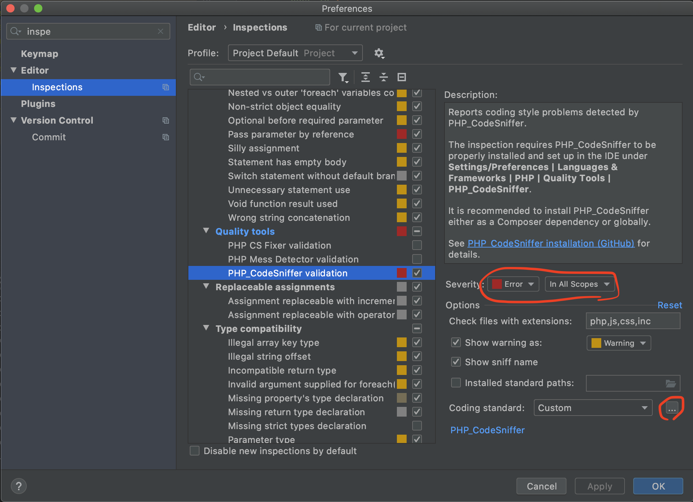
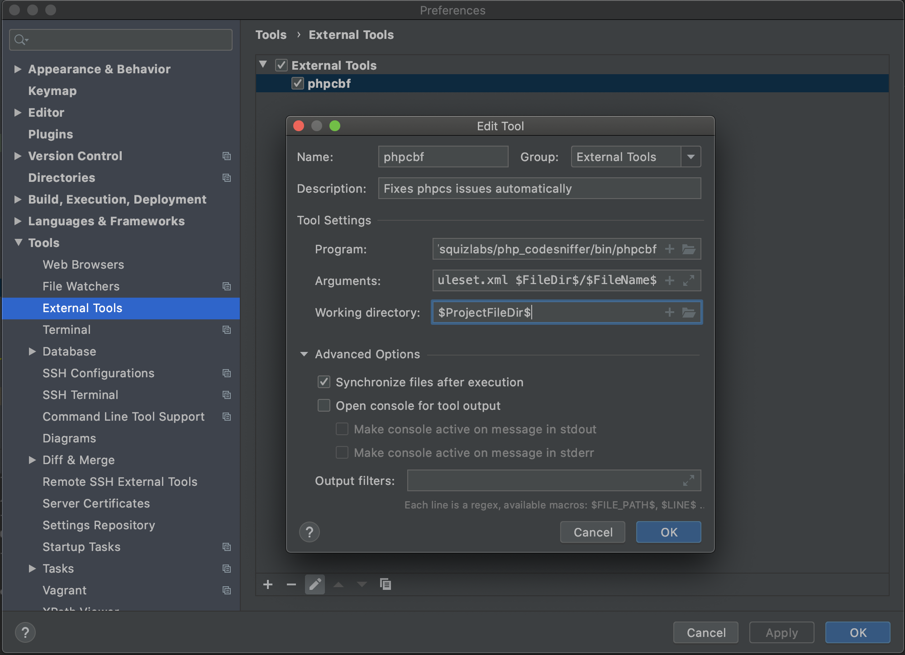

# Maagiline PHP coding standard
Use this coding standard in your local development environment, as well as in CI pipelines.

## Add to your project
First, install via composer:
```
composer require maagiline/maagiline-phpcs
```

Then, create a ruleset in you project directory. The ruleset should:
- Refer to the maagiline-phpcs ruleset for instructions
- Specify which files / directories to scan

Here's an example of a `ruleset.xml` that you should use for a Laravel project:
```
<?xml version="1.0"?>
<ruleset>
    <!-- For setup guide refer to vendor/maagiline/maagiline-phpcs/readme.md-->
    <rule ref="./vendor/maagiline/maagiline-phpcs"/>

    <!-- Don't scan these directories -->
    <exclude-pattern>./bin/</exclude-pattern>
    <exclude-pattern>./bootstrap/</exclude-pattern>
    <exclude-pattern>./config/</exclude-pattern>
    <exclude-pattern>./public/</exclude-pattern>
    <exclude-pattern>./resources/</exclude-pattern>
    <exclude-pattern>./storage/</exclude-pattern>
    <exclude-pattern>./vendor/</exclude-pattern>

    <!-- Dont require namespace in migrations -->
    <rule ref="PSR1.Classes.ClassDeclaration.MissingNamespace">
        <exclude-pattern>./database/</exclude-pattern>
    </rule>
</ruleset>

```

## Set up in PhpStorm
### Set up code sniffing
Code sniffing will instruct your editor to display style issues in your code.

1. In PhpStorm settings, navigate to Languages & Frameworks > PHP > Quality Tools
1. For PHP Codesniffer path, enter: `vendor/bin/phpcs`
1. In PhpStorm settings, navigate to Editor > Inspections > Quality tools > PHP_Codesniffer validation
1. Check this option
1. Set Severity to "Error"
1. In Coding standard, select custom and select `./ruleset.xml` (pointing to the `ruleset.xml` that you created in your project root)



### Set up code beautifier
Some errors can be fixed automatically by `phpcbf`. Wanna go full-on badass? Set up PhpStorm to fix your style issues automatically.

#### Set up phpcbf as external tool
First, add phpcbf under "External tools".
1. In PhpStorm settings, navigate to Tools > External Tools
1. Add a new tool (click plus sign in bottom of window)
1. Enter following info
```
Name:               phpcbf
Description:        Fixed phpcs issues automatically
Program:            $ProjectFileDir$/vendor/squizlabs/php_codesniffer/bin/phpcbf
Arguments:          --standard=$ProjectFileDir$/ruleset.xml $FileDir$/$FileName$
Working directory:  $ProjectFileDir$

Under 'Advanced options', uncheck "Open console for tool output".
```


#### Trigger phpcbf from keyboard shortcut
After clicking "Apply" in the previous menu, do this:
1. In PhpStorm settings, navigate to Keymap
1. Search for "phpcbf"
1. Assign a shortcut. I like to use `cmd+shift+B`

Now, whenever in a file that has errors, tap this to run phpcbf. All errors that can be fixed automatically will be fixed.

#### Trigger phpcbf on file save
(NOT TESTED). If you wish to run phpcbf automatically whenever a file is saved, you can create a File Watcher in PhpStorm settings. The settings should be similar to those outlined in the previous section. Be brave!

## Command line tools
To list errors:
```
./vendor/bin/phpcs --standard=./ruleset.xml
```

Some errors can be fixed automatically. To fix automatically:
```
./vendor/bin/phpcbf --standard=./ruleset.xml
```
